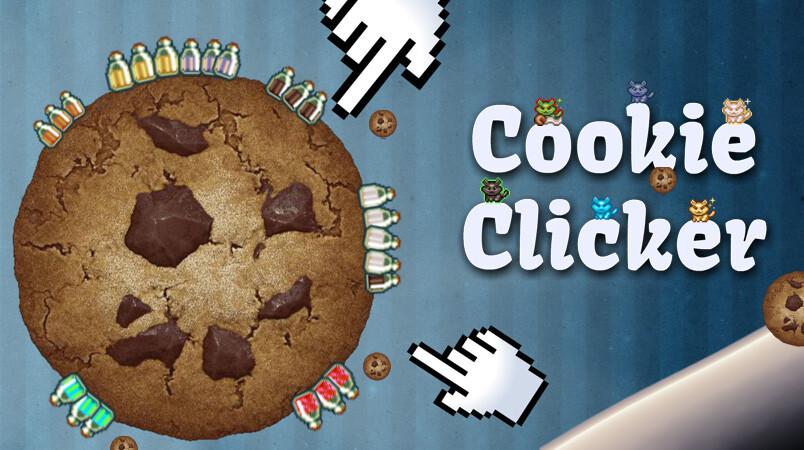
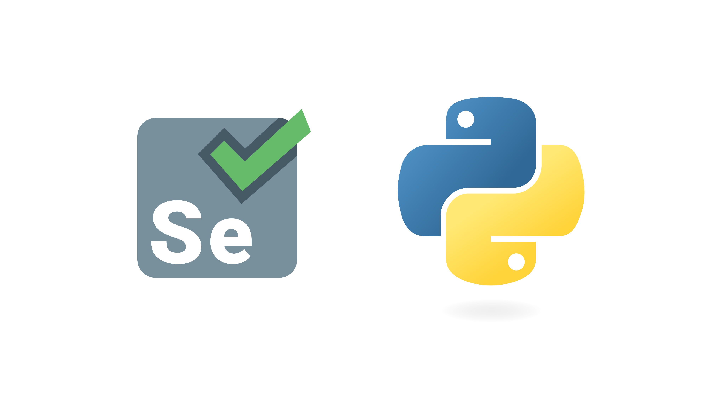

# **Selenium Automated Script for Cookie Clicker**
A Selenium Webdriver script for automating clicks in the Cookie Clicker web application. 

## Objective
Currently, the script can automate clicks and auto-purchase "cursor" and "Grandma" once the options are unlocked. Since the game can be quite long in terms of upgrades and efficient decision-making, this script is still a work in progress.

    

## About
The *Cookie Clicker* is a 2013 incremental game developed by Julien "Orteil" Thiennot, a French programmer who wrote the script in a single evening. The user initially clicks on a big cookie on the screen that earns a single cookie with each click, which can be used to purchase tools such as "cursors" and other "buildings" that would automatically produce cookies. There are several upgrades that are also available once a certain threshold is reached, which can be done by first manually clicking the "Cookie". The player can later improve the efficiency of clicks and buildings, among many other mechanics that allow the user to earn cookies in a myriad of ways.

## Modules and Tools used:
* python 3.11
* selenium 4.8.3

    

## Installation (using pip)
In order to *install* selenium on the local machine, follow these steps:
1. Open pip and type "pip install selenium".
2. Alternately, it can be downloaded from the primary distribution source [PyPI](https://pypi.org/project/selenium/#files),
unarchive it, and run: "python setup.py install"

For more information, check out the following sites:
* https://pypi.org/project/selenium/
* https://orteil.dashnet.org/cookieclicker/
